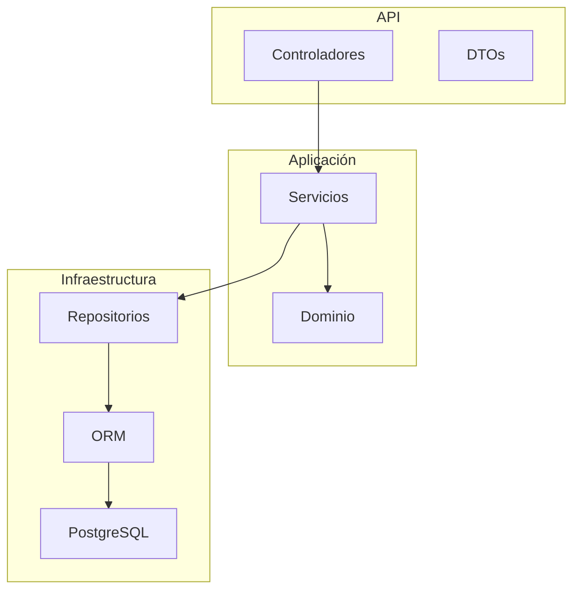
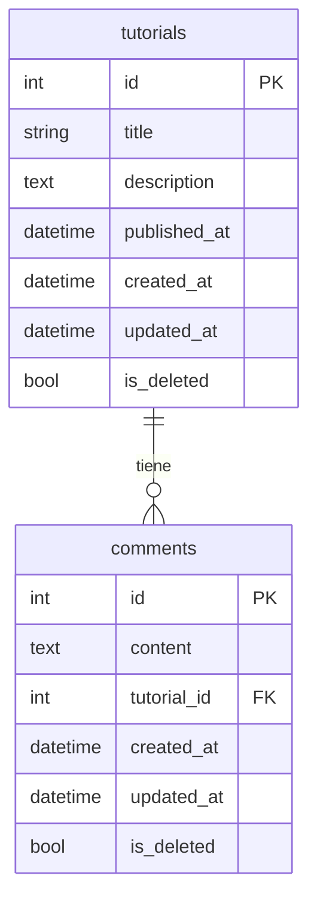

# OATI-CRUD

API REST para gestión de tutoriales y comentarios, construida con **Go 1.26**, **Beego v2** y **PostgreSQL**. Incluye documentación Swagger, contenedorización con Docker y eliminación lógica.

## Despliegue

| Recurso | URL |
|---|---|
| API (Render) | https://oati-crud.onrender.com |
| Swagger (Render) | https://oati-crud.onrender.com/swagger/ |
| Frontend (Render) | https://oati-crud-front.onrender.com |

## Stack tecnológico

- Go 1.26
- [Beego v2](https://beego.me/) — framework web
- PostgreSQL 16
- Beego ORM + driver `lib/pq`
- Docker / Docker Compose
- Swagger UI (OpenAPI 2.0)

## Arquitectura

El proyecto sigue **arquitectura limpia (Clean Architecture)** con separación de capas:



| Carpeta | Responsabilidad |
|---|---|
| `controllers/` | Endpoints HTTP |
| `services/` | Lógica de negocio |
| `domain/` | Entidades y reglas de dominio |
| `repositories/` | Interfaces de persistencia |
| `infrastructure/` | ORM, conexión a la base de datos, implementación de repositorios |
| `dtos/` | Peticiones y respuestas JSON |
| `routers/` | Rutas Beego con namespace `/api/v1` |
| `swagger/` | Especificación OpenAPI + interfaz interactiva |

## Modelo de datos

- Un **tutorial** puede tener **N comentarios**.
- Un **comentario** pertenece a un solo tutorial (clave foránea `tutorial_id`).
- Ambas tablas tienen la columna `is_deleted` para **eliminación lógica**.
- Al eliminar un tutorial, también se marcan como eliminados todos sus comentarios asociados.

### Diagrama de la base de datos



## Requisitos previos

- Go 1.26+
- Docker y Docker Compose (recomendado)
- PostgreSQL 16 (solo si ejecutas sin Docker)

## Configuración de entorno

Copia el archivo de ejemplo y ajusta los valores para ejecución local:

```bash
cp .env.example .env
```

| Variable | Local | Docker |
|---|---|---|
| `DB_HOST` | `localhost` | `db` |
| `DB_PORT` | `5432` | `5432` |
| `DB_NAME` | `tutorials_db` | `tutorials_db` |
| `DB_USER` | `postgres` | `postgres` |
| `DB_PASS` | `postgres` | `postgres` |
| `DB_SSLMODE` | `disable` | `disable` |
| `CORS_ALLOWED_ORIGINS` | ver `.env.example` | `http://localhost:4200` (solo aplica en producción) |

En Docker, las variables se definen en `docker-compose.yml` — no necesitas un archivo `.env` dentro del contenedor.

## Ejecución con Docker (recomendado)

```bash
docker compose up --build
```

| Recurso | URL |
|---|---|
| API | http://localhost:8080 |
| Swagger | http://localhost:8080/swagger/ |

Detener los contenedores:

```bash
docker compose down
```

Detener y **eliminar los datos** de la base de datos:

```bash
docker compose down -v
```

## Ejecución local (sin Docker)

1. Asegúrate de tener PostgreSQL corriendo y crea la base de datos:

```bash
createdb tutorials_db
```

2. Configura `.env` con tus credenciales (ver tabla arriba).

3. Inicia la aplicación:

```bash
go run main.go
```

La API estará disponible en http://localhost:8080.

## Endpoints de la API

Ruta base: `/api/v1`

| Método | Ruta | Descripción | Respuesta |
|---|---|---|---|
| GET | `/tutorials` | Listar tutoriales | `TutorialListResponse` |
| POST | `/tutorials` | Crear tutorial | `TutorialResponse` |
| GET | `/tutorials/:id` | Detalle con comentarios anidados | `TutorialDetailResponse` |
| PUT | `/tutorials/:id` | Actualizar tutorial | `TutorialResponse` |
| DELETE | `/tutorials/:id` | Eliminación lógica del tutorial y sus comentarios | 204 |
| GET | `/tutorials/:tutorialId/comments` | Listar comentarios de un tutorial | `CommentListResponse` |
| POST | `/tutorials/:tutorialId/comments` | Crear comentario | `CommentResponse` |
| PUT | `/comments/:id` | Actualizar comentario | `CommentResponse` |
| DELETE | `/comments/:id` | Eliminación lógica de un comentario | 204 |

## Ejemplos de uso

### Crear un tutorial

El campo `published_at` debe estar en formato **RFC3339**:

```bash
curl -X POST http://localhost:8080/api/v1/tutorials \
  -H "Content-Type: application/json" \
  -d '{
    "title": "Go basics",
    "description": "Introducción a Go",
    "published_at": "2026-06-18T00:00:00Z"
  }'
```

### Listar tutoriales

```bash
curl http://localhost:8080/api/v1/tutorials
```

### Obtener tutorial con comentarios

```bash
curl http://localhost:8080/api/v1/tutorials/1
```

### Crear un comentario

```bash
curl -X POST http://localhost:8080/api/v1/tutorials/1/comments \
  -H "Content-Type: application/json" \
  -d '{"content": "Muy buen tutorial"}'
```

### Actualizar un tutorial

```bash
curl -X PUT http://localhost:8080/api/v1/tutorials/1 \
  -H "Content-Type: application/json" \
  -d '{
    "title": "Go basics (actualizado)",
    "description": "Contenido revisado",
    "published_at": "2026-06-18T12:00:00Z"
  }'
```

### Eliminar un comentario

```bash
curl -X DELETE http://localhost:8080/api/v1/comments/1
```

### Eliminar un tutorial

```bash
curl -X DELETE http://localhost:8080/api/v1/tutorials/1
```

Tras eliminar, un `GET` sobre el recurso devuelve `404`.

## Eliminación lógica

Los registros **no se borran físicamente** de la base de datos. En su lugar, la columna `is_deleted` se marca como `true`.

| Operación | Comportamiento |
|---|---|
| `GET` (cualquier listado o detalle) | Solo devuelve registros con `is_deleted=false` |
| `DELETE /comments/:id` | Marca el comentario como eliminado |
| `DELETE /tutorials/:id` | Marca el tutorial y **todos sus comentarios** como eliminados |
| `GET` sobre un recurso eliminado | Responde `404` |

### Validar en la base de datos (Docker)

Entrar a PostgreSQL:

```bash
docker compose exec db psql -U postgres -d tutorials_db
```

Consultar el estado de eliminación:

```sql
SELECT id, title, is_deleted FROM tutorials ORDER BY id;
SELECT id, tutorial_id, content, is_deleted FROM comments ORDER BY id;
```

Salir de psql: `\q`

Consulta combinada:

```sql
SELECT t.id AS tutorial_id, t.title, t.is_deleted AS tutorial_deleted,
       c.id AS comment_id, c.content, c.is_deleted AS comment_deleted
FROM tutorials t
LEFT JOIN comments c ON c.tutorial_id = t.id
ORDER BY t.id, c.id;
```

## Swagger

Documentación interactiva (OpenAPI 2.0):

| Entorno | URL |
|---|---|
| Producción (Render) | https://oati-crud.onrender.com/swagger/ |
| Local / Docker | http://localhost:8080/swagger/ |

Disponible cuando la app está en modo `dev` (configuración por defecto en local y en el despliegue actual).

### Regenerar documentación

Tras modificar anotaciones `@router` o `@Param` en los controladores:

```bash
go run github.com/beego/bee/v2@latest generate routers
go run github.com/beego/bee/v2@latest generate docs
```

> **Importante:** `routers/commentsRouter.go` es generado por `bee generate routers` y es necesario para que las rutas funcionen. En Docker, esto se ejecuta automáticamente durante la compilación de la imagen (ver `Dockerfile`).

Los DTOs de petición incluyen etiquetas `example` y `description` que se reflejan en la interfaz de Swagger.

## CORS

La API incluye un filtro CORS (`middleware/cors.go`) para permitir peticiones desde clientes en otro origen.

| Modo | Comportamiento |
|---|---|
| `dev` (`runmode=dev`) | Permite cualquier origen (`Access-Control-Allow-Origin: *`) |
| `prod` (`runmode=prod`) | Solo orígenes listados en `CORS_ALLOWED_ORIGINS` |

Variable de entorno (producción):

```env
CORS_ALLOWED_ORIGINS=http://localhost:4200,https://oati-crud-front.onrender.com
```

Verificar la solicitud preflight con curl:

```bash
curl -i -X OPTIONS http://localhost:8080/api/v1/tutorials \
  -H "Origin: http://localhost:4200" \
  -H "Access-Control-Request-Method: POST"
```

## Desarrollo

### Compilar

```bash
go build ./...
```

### Configuración de la app

Archivo `conf/app.conf`:

| Parámetro | Valor | Descripción |
|---|---|---|
| `httpport` | `8080` | Puerto del servidor |
| `runmode` | `dev` | Modo de ejecución (Swagger activo en modo desarrollo) |
| `CopyRequestBody` | `true` | Requerido para leer el cuerpo JSON en POST/PUT |

### Migraciones

Las tablas se crean y actualizan automáticamente al iniciar la app mediante `orm.RunSyncdb` en `main.go`. No se requieren scripts de migración manuales.

### Estructura de respuestas de error

```json
{
  "code": 400,
  "message": "descripción del error"
}
```

Códigos HTTP comunes:

| Código | Situación |
|---|---|
| 400 | JSON inválido, datos faltantes, formato de fecha incorrecto |
| 404 | Tutorial o comentario no encontrado (incluye eliminados lógicamente) |
| 500 | Error interno del servidor |
